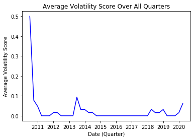

# Elon-Musk-Tweet-Classifier

## Executive Summary:

<br><b>1. Problem Statement:</b>
Problem Statement: Does Elon Musk's tweets be an accurate predictor of Tesla's stock price volatility and will build a model to predict the probability that a Musk tweet coincides with a 3 percent or more gain or loss in stock price.

<br><b>2. Background Info:</b>

On August 7th, 2018, Tesla CEO Elon Musk tweeted that had secured funding to take Tesla private at 420 dollars per share. This price estimate was much higher than the price 341 dollars per share thus leading investors to drive up the price based on the assumption that the shares would be worth 420 dollars per share.

It was later revelaed that Musk may overstated his level certainty when it came to the buyout offer (which never materialized) which then lead the US Securities and Exchange Commission to investgate Musk for securities fraud.

The SEC, in a settlment with Musk agreed to have someone from Tesla monitor the CEO's tweets. A subsequent settlement clarified the topics Musk was forbidden from tweeting about.

https://www.sec.gov/news/press-release/2018-226

https://www.washingtonpost.com/technology/2019/04/26/elon-musk-sec-resolve-dispute-over-teslas-ceos-tweets/

#### File Directory:
- elon_tweets.ipynb (file that scrapes and analyzes Elon Musk's tweet information)
- elon.csv (exported tweet data stored in a static .csv file)
- price.csv (exported Tesla stock data stored in static .csv file)

#### Python Packages Used:
```import requests # necessary for accessing API
import numpy as np
import pandas as pd
import seaborn as sns
import matplotlib.pyplot as plt
from datetime import datetime, date, timedelta
import GetOldTweets3 as got # useful for accessing tweet history

# import modling packages
from sklearn.model_selection import train_test_split, GridSearchCV, RandomizedSearchCV
from sklearn.feature_extraction.text import CountVectorizer, TfidfVectorizer
from sklearn.ensemble import RandomForestClassifier
from sklearn.pipeline import Pipeline
from sklearn.metrics import roc_curve, precision_recall_curve, auc,\
      make_scorer, recall_score,\
      accuracy_score, precision_score, confusion_matrix, \
      roc_auc_score, classification_report
```

#### Preliminary Analysis
Stock Price Volatility Score Over Time





Model Evaluation


